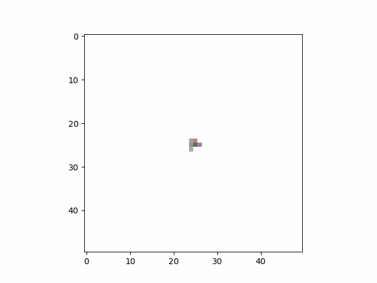

# Playing around with Neural Cellular Automata
This is a partial re-implementation of the cool Distill post [Growing Neural Cellular Automata](https://distill.pub/2020/growing-ca/) (using Pytorch). My goals were 1) to do this as a coding exercise and 2) to have a platform for playing with some ideas I have around CAs. It is definitely rough around the edges.

## More info
You can read more here: https://chrissarmstrong.github.io/seeking-manifold/Experiment-Ideas/Neural-Cellular-Automata

